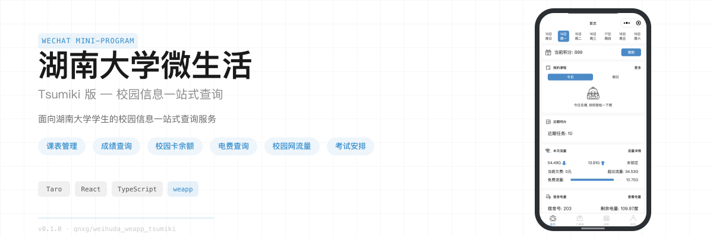

<p align="center">
  
</p>

# 湖南大学微生活小程序 (Tsumiki 版)

湖南大学校园信息一站式查询微信小程序. 课表管理、成绩查询、校园卡余额、电费查询、校园网流量、考试安排等校园服务, 一个小程序全部搞定.

本项目是 [weihuda_weapp](https://github.com/qnxg/weihuda_weapp) 前端的新版本, 基于 Taro 4 + React 18 + TypeScript 重写, 对工程化、状态管理、样式方案与项目结构进行了重新设计.

## 功能特性

### 首页卡片

首页以可自定义排序的卡片形式聚合校园信息: 积分、课程、流量、电量、校园卡余额、近期待办、假期倒计时、邮箱、成绩查询, 支持深色模式自适应.

### 课表管理

周视图课表展示, 支持查看课程详情(授课教师、上课班级、周次范围), 添加自定义课程, 设置显示 / 隐藏非本周课程, 以及无课表课程查看.

### 成绩与排名

- **成绩查询** — 教务系统成绩, 按学期查看, 支持成绩详情展开
- **成绩排名** — 教务系统排名与可信电子凭证排名
- **实验成绩** — 大物实验平台成绩
- **体测成绩** — 体测成绩查询, 含单项成绩可视化

### 课程与考试

- **考试安排** — 教务系统考试安排, 支持自定义考试条目
- **实验安排** — 大物实验安排 (开发中)
- **体测预约** — 体测预约 (开发中)

### 校园与生活

- **空教室查询** — 按教学楼、时间段查询空闲教室
- **校历查看** — 学期校历一览
- **校园卡账单** — 校园卡消费记录查询
- **校园网流量** — 月度流量账单与流量详情
- **电费查询** — 宿舍电费余额查询
- **体测标准** — 体测评分标准介绍

### 其他

- **积分中心** — 积分查询、积分兑换、积分规则
- **意见反馈** — 提交反馈, 查看反馈历史
- **消息盒子** — 消息通知 (开发中)
- **设置** — 首页卡片排序、课表设置、小程序设置

## 技术架构

完整的目录组织说明与页面汇总见 [项目结构](docs/structure.md).

```
┌─────────────────────────────────────────────────┐
│                 WeChat Mini-Program              │
├─────────────────────────────────────────────────┤
│  Taro 4.1.11  ·  React 18  ·  TypeScript 5     │
├─────────────────────────────────────────────────┤
│  请求层: request → auth-request → API 模块       │
│  状态层: Context (auth / setting / semester)     │
│  Hook 层: useQuery / useMutation / useCachedQuery│
│  样式层: 原子类 + 内联 style + SCSS 兜底         │
├─────────────────────────────────────────────────┤
│  页面路由 · Taro 分包 (主包 / tools / setting / about) │
└─────────────────────────────────────────────────┘
```

**核心设计决策:**

- **状态管理** — 仅用 React Context, 无 Redux / Zustand. Context 只放状态变量与 setter, 复杂业务逻辑下沉到 Hook (状态业务分离)
- **请求体系** — 三层请求: `request`(通用请求) → `auth-request`(自动鉴权 + 401 恢复) → `api`(业务接口). 自研 TanStack Query 风格 Hook (`useQuery` / `useMutation` / `useCachedQuery`), 因 react-query 在 Taro 环境存在兼容性问题
- **样式方案** — 自维护原子类 (颜色 / 文本 / 布局 / 间距 / 尺寸), 配合内联 style, SCSS 仅作为兜底. 不使用 Tailwind CSS (小程序 wxss 兼容性限制)
- **项目结构** — 按页聚合 + 非结构化命名: 页面专用组件放在页面目录下, 全局通用内容放 `src/components/` 等, 文件仅以 Feature 命名, 通过路径区分功能层级

## 快速开始

环境准备、安装启动、微信开发者工具导入与 Mock 接口配置, 请见 [部署项目](docs/deploy.md).

常用命令:

```bash
pnpm dev      # 开发监听, 实时构建
pnpm build    # 生产构建
pnpm check    # 类型检查
pnpm lint     # 代码检查
pnpm fix      # 自动修复
```

## 贡献

欢迎贡献代码. 请先阅读 [贡献指南](docs/CONTRIBUTING.md), 了解分支规范、提交规范与 AI 协作要求.

### 提交规范

提交信息遵循 [Conventional Commits](https://www.conventionalcommits.org/), 描述使用中文. 示例:

```
feat(体测标准): 完成体测标准介绍页和男生页
fix(index): 修复课表卡片在深色模式下文字不可见的问题
docs: 补充贡献指南的代码提交规范
```

## 文档

详细设计文档与开发规范位于 `docs/` 目录:

- [项目结构](docs/structure.md) — 按页聚合 + 按路径分类
- [状态管理](docs/state-manager.md) — Context + Hook 状态业务分离
- [样式方案](docs/style-scheme.md) — 原子类 + 内联 + SCSS 兜底
- [通用组件与函数](docs/common-function.md) — 可复用模块清单
- [部署项目](docs/deploy.md) — 开发环境搭建
- [贡献指南](docs/CONTRIBUTING.md) — 开发流程与规范
