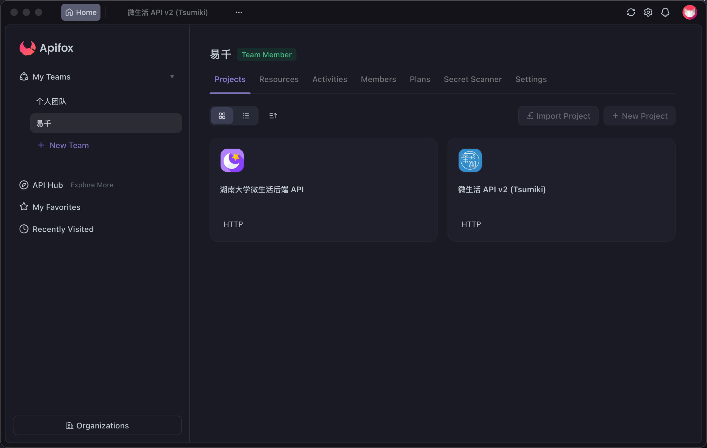
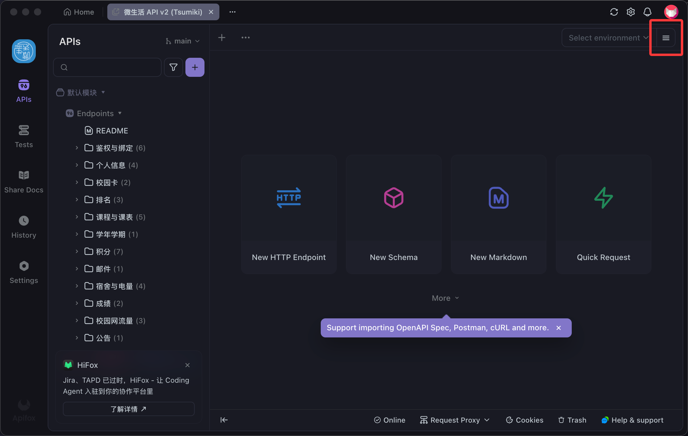
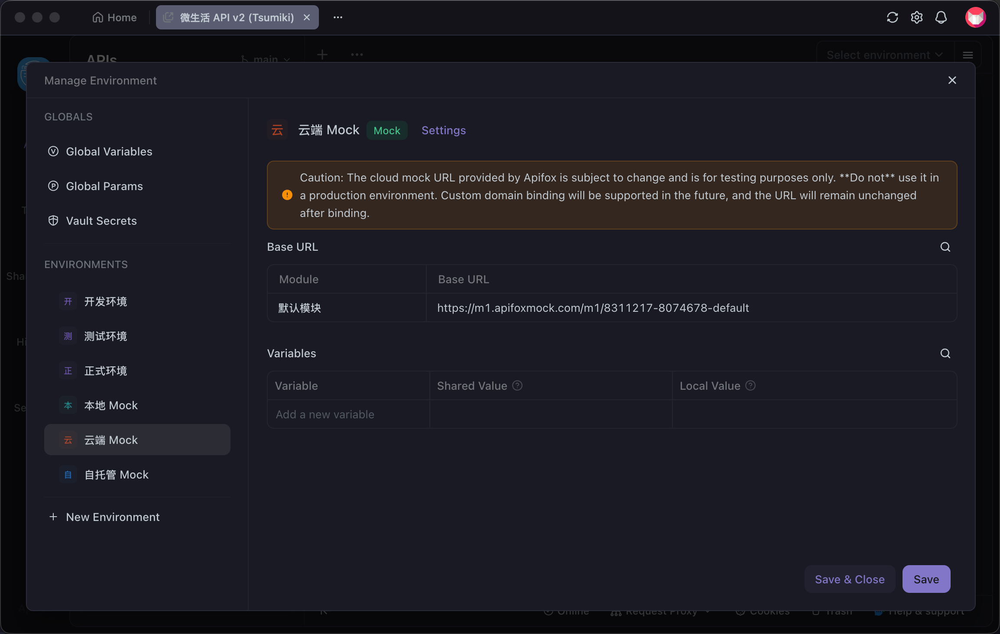
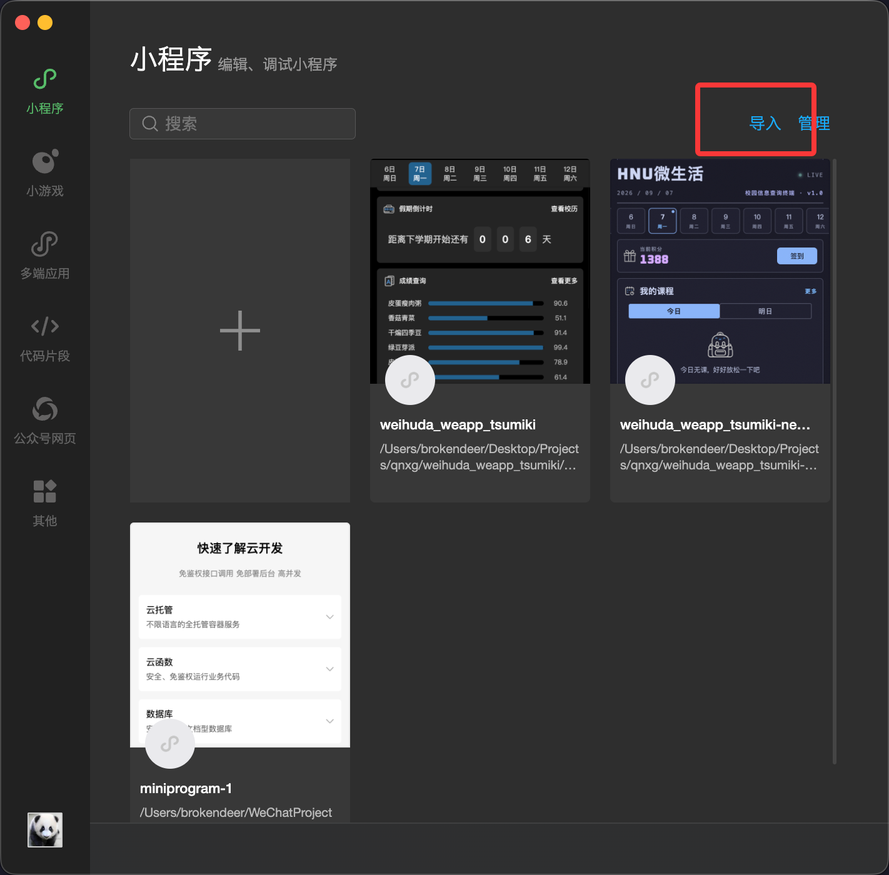
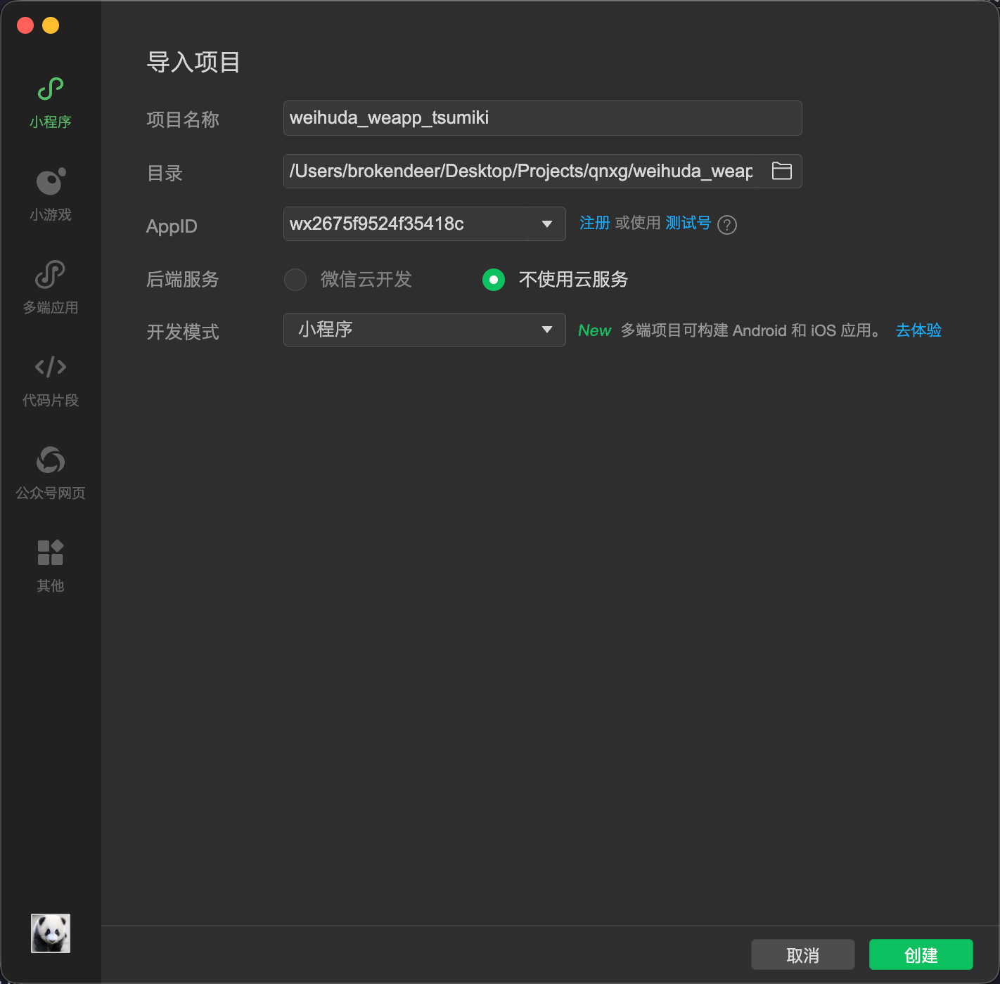
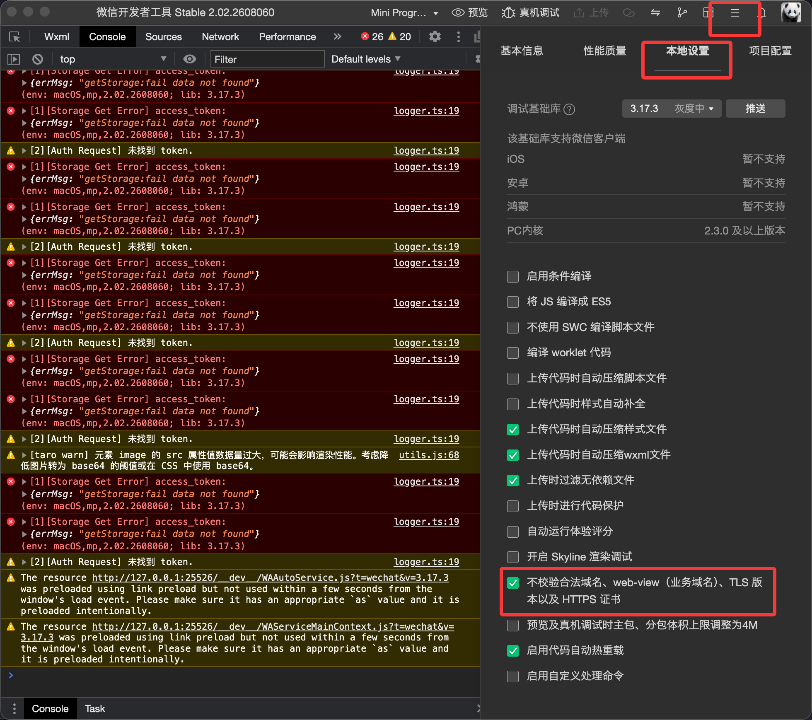

# 部署项目

在进行工作之前, 你需要确保项目的开发环境可以在你的电脑上正常运行. 你可以参照这篇教程来完成项目的部署.

## 准备工作

在开始前, 你需要安装这些:

- [Node.js 22](https://nodejs.org) (参考 `.nvmrc`), 并使用 Corepack 或全局安装启用 [pnpm](https://pnpm.io/zh/) `11.10.0`.
- [微信开发者工具](https://developers.weixin.qq.com/miniprogram/dev/devtools/download.html)
- [Apifox](https://docs.apifox.com/download) (可选), 用于未启动后端服务时为前端提供 Mock 接口. 若不安装桌面版应用, 也可使用网页版.

> [!IMPORTANT]
>
> 本项目使用 pnpm 管理依赖. 请不要混用 `npm` 或 `yarn`, 否则可能会出现依赖相关的问题 (项目下出现 `package-lock.json` / `yarn.lock` 即表示混用了其他包管理器).

然后你需要克隆存储库并安装依赖:

1. 克隆此存储库

```shell
git clone https://github.com/qnxg/weihuda_weapp_tsumiki
cd weihuda_weapp_tsumiki/
```

2. 安装依赖

```shell
pnpm install
```

## Mock 接口配置 (可选)

Mock 接口仅在你未启动后端服务时使用. 若已在本地运行后端, 可跳过本节, 使用 `.env-example` 中默认的后端地址即可 (见下节).

1. 前往 [Apifox 网站](https://apifox.com) 安装 Apifox. 不建议使用网页版, 因为可能无法使用 Mock 功能.
2. 获取 Apifox 接口文档邀请链接. <!-- TODO: 公开接口文档后需要改为具体的获取方式 -->
3. 接受邀请后, 左侧 `我的团队` 中会出现 `易千`, 点击进入后, 右侧选择 `微生活 API v2 (Tsumiki)`.



4. 页面右上角点击三条横线图标, 找到云端 Mock, 复制 `默认模块` 的 `前置 URL` 的值.





## 配置并启动项目

将项目根目录下的 `.env-example` 文件复制一份并更名为 `.env`.

默认情况下, `TARO_APP_BASE_URL` 指向本地后端地址 `http://localhost:8080`. 若你选择使用 Mock 接口 (未启动后端), 则需将其改为上一节复制的 `前置 URL`, 例如 `TARO_APP_BASE_URL="https://example.com/xxxxxx"`.

然后启动项目:

```shell
pnpm dev
```

运行以上命令后, 当前工作目录中会出现 `dist` 文件夹, 这是项目的打包结果. 当 `src/` 下被 import 的模块或 Taro 配置文件发生变化时, 项目会被重新构建.

## 将项目导入微信开发者工具

构建完成后, 你需要:

1. 打开微信开发者工具.
2. 点击右上角的 `导入`, 并选择项目目录下的 `dist` 目录.



3. AppID 处可选择使用测试号, 然后在后端服务中选择 `不使用云开发`, 点击 `创建` 按钮.



4. 回到微信开发者工具, 点击右上角三条横线图标, 在 `本地设置` 中勾选 `不校验合法域名`.


