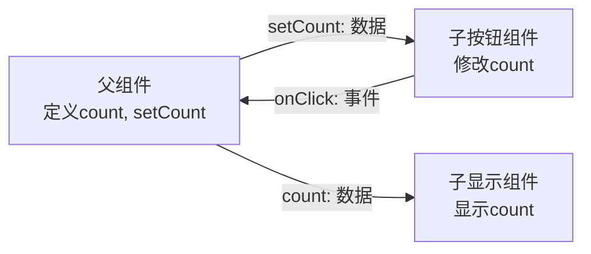
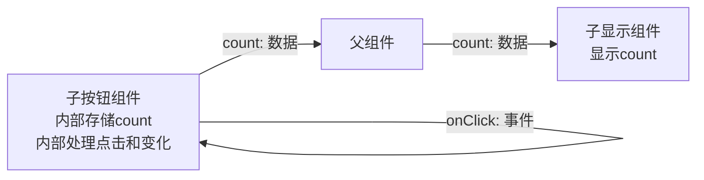

# 状态管理

React 提出了 `UI = f(state)` 的设计理念, 即组件显示的 UI 为状态的函数, 即一种状态对应于一个固定的 UI, 状态是整个页面变化的自变量.

状态是唯一的自变量, 但根据状态可以派生出其他的变量, 又可能需要封装一些操作状态的函数, 这些内容统称为状态管理.

## 状态组织方案

### 状态变量

#### 定义与消费

状态变量是最简单的状态组织方案, 使用 `useState` 定义状态变量, 在 `jsx` 部分直接使用状态变量, 适用于状态较少且不需要封装复杂操作的情况.

状态变量带来的变化, 称为 `副作用 (effect)`, 可使用 `useEffect` 监听状态变量的变化, 在变化时执行副作用函数, 适用于需要在状态变化时执行一些操作的情况.

> 组件 `jsx` 部分本身也会响应状态变量的变化, 因此实际上整个组件也是一个 effect 处理器, 只不过这部分内容由 React 调度器自动实现, `useEffect` 则用于处理其他副作用.

此外, 有时需要某变量和某状态变量保持同步, 称为 `计算属性 (computed)`, 可使用 `useMemo` 定义计算属性, 适用于需要根据状态变量计算出其他变量的情况.

#### 修改

React 认为状态变量应该是 `immutable` 的, 即不应该直接修改状态变量的值, 而应该通过 `setState` 函数来修改状态变量的值, 以便 React 能够正确地调度组件的更新.

`setState` 函数接受一个新的状态值, 或一个返回新状态值的函数, 并触发 React 调度器对此次修改副作用的自动处理.

对于简单值, `setState` 将直接修改, React 也将直接比较;

对于对象 / 函数等, React 比对的是整个内容的引用, 因此需要保证每次修改都返回一个新的对象 / 函数, 所有 React 对于对象部分修改的方案是:

```ts
setObj(p => ({
  key: newValue,
  ...p,
}))
// 此处推荐统一使用 p 命名, 意为 prev
```

#### 稳定引用

由于 React 比对的是对象的引用, 因此当传入新对象和原对象值一致时, 依旧会触发 React 的更新, 因为引用不一致, 因此 React 有时需要稳定它们的引用.

用于稳定引用的函数有 `useCallback` 和 `useMemo`, 前者用于稳定函数的引用, 后者用于稳定其他值的引用, 适用于需要将某些值传递给子组件或依赖数组的情况.

> 注意 `useCallback` 用于函数稳定, 但虽然组件本身就是个函数, `useCallback` 也不能用于组件自身的稳定.
>
> 因为 React 的更新实际上是组件函数的重新调用, 而非引用对象的更新, 因此组件函数本身的引用不稳定, 但 React 不需要它稳定, 因此 `useCallback` 不能用于组件自身的稳定.
>
> 此外 `useCallback` 为 `React Hook`, 不能在组件外部使用.

### 简单跨组件状态共享

React 遵循 `单向数据流` 的设计理念, 即数据只能从父组件流向子组件, 不允许数据的回传.

实现类似 `数据回传` 的方法是父组件捕获子组件的状态回调, 即子组件暴露一个 `on函数`, 父组件传入一个函数作为 `on函数` 的值, 当子组件需要回传数据时, 调用 `on函数` 并传入数据, 父组件在 `on函数` 中接收数据并更新状态变量, 以便将数据流回父组件.

上述过程应该看做父组件对子组件变化状态的侦测与处理, 而非子组件对父组件状态的修改和回传, 因此与 `单向数据流` 理念并不冲突, 请勿按上述错误理解进行开发.

例如如下设计是可行的:


因为语义上讲, `onClick` 是事件, 不是传递的数据; 尽管它也是传入的 `props` 之一

跨组件传递状态时, 需要将状态提升到最近的共享父组件中, 子组件只消费父组件传入的状态变量.



而如下结构是不允许的



### 大范围跨组件状态共享

对于大范围的状态共享, 由非常高阶的父组件一路将状态传递到需要的子组件, 需要非常多的 `props` 传递, 十分不便

因此, React 提供了 `Context (上下文)` 机制, 可以在一整个范围内共享状态

#### 结构

React Context 由 `Context 上下文本体`, `Context Provider 作用范围标记` 和 `useContext hook` 组成

- `Context 上下文本体`: 由 `createContext` 创建, 定义了 Context 的类型和默认值
- `Context Provider 作用范围标记`: 由 `Context.Provider` 组件提供, 用于标记 Context 的作用范围, 接收一个 `value` 属性作为 Context 的值
- `useContext hook`: 由 `useContext` 创建, 用于在组件中消费 Context 的值, 接收一个 Context 对象作为参数, 返回 Context 的当前值

#### 创建

本项目中一个 Context 命名为 `/contexts/xxx.tsx`, 如下所示:

```tsx
// 定义 Context 本地类型, 包括状态变量和操作函数等
interface ExampleContextValue {
  count: number
  setCount: (count: number) => void
}

// 创建 Context 对象, 定义默认值
const ExampleContext = createContext<ExampleContextValue | null>(null)

// 创建 Context Provider 组件, 定义状态变量和操作函数
export function ExampleProvider({
  children,
}: Readonly<{
  children: ReactNode
}>) {
  // Context 内需要共享的状态变量和操作函数
  const [count, setCount] = useState(0)

  // 和 Context 定义类型一致的值
  const value = useMemo(() => ({
    count,
    setCount,
  }), [count])

  return (
    <ExampleContext.Provider value={value}>
      {children}
    </ExampleContext.Provider>
  )
}

// 创建 Context 消费用 hook
export function useExampleContext() {
  const context = useContext(ExampleContext)
  // 范围检测兜底
  if (!context) {
    throw new Error("useExampleContext must be used within a ExampleProvider")
  }
  return context
}
```

#### 使用

React 对 context 的默认使用方式是通过 `useContext hook` 在组件中直接消费 Context 的值, 但上述组件中, 我们已经封装并暴露了 `useExampleContext hook`, 直接使用该 hook 即可, 这也是 React 社区更为推荐的做法

### 全局状态共享

context 作用范围仅在 `Provider` 内部, 但 `Provider` 可直接挂载到 `App.tsx` 中, 以实现全局的状态共享

但 context 可能存在一定的性能问题, 因此 React 社区提出了新的全局状态共享方案, 称为 `store`

主流的 store 有 `Redux`, `Zustand` 等, 其中 `Redux` 经典但过于庞大, `Zustand` 更加轻量且原子化

> 本项目未使用任何 store, 所有的全局状态共享均通过 context 完成
>
> 因为本项目体量, 使用 `Redux` 并不合适, 而 `Zustand`, 由于 `Zustand` 基于 bundle 实现, 而 Taro 并不支持该加载方案, 因此该库无法使用

## 状态消费方案

### 状态变量

本项目中, 若 `setState` 有用到原值, 则要求强制使用函数式更新, 以保证状态修改的正确性, 并避免潜在的死循环问题, 例如:

```ts
// eslint-disable-next-line react-hooks/rules-of-hooks
useEffect(() => {
  const newArr = [...arr, ...newParts]
  setArr(newArr)
}, [arr, newParts])
```

当 arr 被 set 时, 由于 arr 是依赖项, 因此 useEffect 会重新执行, 但由于 setArr 的值与原值不同, 因此会触发 React 的更新, 导致死循环

因此不得将 state 与 setState 放置到同一个 useEffect 中, 可使用如下方案:

```ts
// eslint-disable-next-line react-hooks/rules-of-hooks
useEffect(() => {
  setArr(p => [...p, ...newParts])
}, [newParts])
```

### 状态业务分离

对于复杂状态和状态共享, 本项目采用 `状态业务分离` 的方案, 即 context 中仅定义最基本的状态变量和操作函数, 其他复杂的业务逻辑放置到 hook 中, 以实现状态业务分离

以 `user` 为例, `contexts/user.tsx` 仅定义了 `user` 状态变量和 `setUser` 操作函数, 其他复杂的业务逻辑如 `fetchUser` 等放置到 `hooks/user.ts` 中

> 注意: context 需保持尽量简单, 但也要保证导出内容稳定, 例如 `semester` 的 `contexts/semester.tsx` 中, 由于定义的数据模型为数组, 直接操作会触发更新, 因此这里需要暴露封装好的稳定的操作函数

本项目中, 对于一整套状态业务分离的状态共享内容, 需要统一格式和命名, 包括内部各个变量, 类型, 注释等, 格式如下:

```tsx contexts/example.tsx
interface ExampleContextValue {
  count: number
  setCount: (count: number) => void
}

const ExampleContext = createContext<ExampleContextValue | null>(null)

export function ExampleProvider({
  children,
}: Readonly<{
  children: ReactNode
}>) {
  const [count, setCount] = useState(0)

  const value = useMemo(() => ({
    count,
    setCount,
  }), [count])

  return (
    <ExampleContext.Provider value={value}>
      {children}
    </ExampleContext.Provider>
  )
}

export function useExampleContext() {
  const context = useContext(ExampleContext)
  if (!context) {
    throw new Error("useExampleContext must be used within a ExampleProvider")
  }
  return context
}
```

```ts hooks/example.ts
/**
 * @property {any} key - 描述
 */
interface ExampleHookResult {
  key: any
}

/**
 * @description 示例 Hook
 */
export function useExample(): ExampleHookResult {
  const { count, setCount } = useExampleContext()

  // 定义计算属性

  // 定义业务函数

  useEffect(() => {
    // 定义副作用处理
  }, [])

  return {
    key: value,
  }
}
```

具体可参考 [通用函数 - 全局状态共享相关函数](./common-function.md/#全局状态共享相关函数) 中的示例
